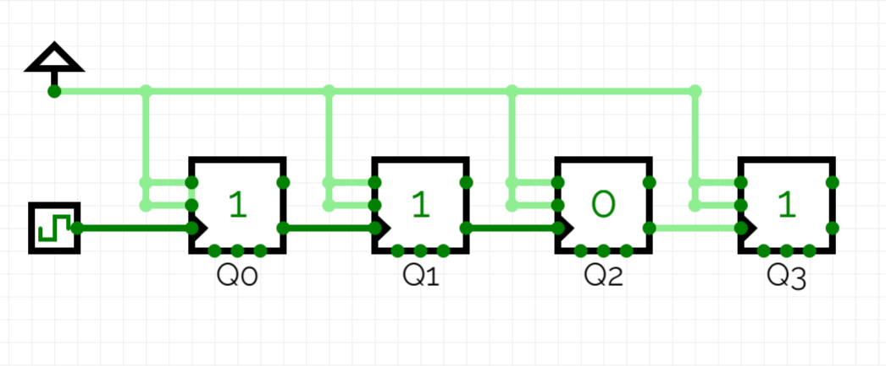

#NOT READY - UNDER DOCUMENTATION PHASE

[link to circuit](https://circuitverse.org/simulator/embed/4-bit-asynchronous-counter-bb0bb235-49c8-49aa-a855-6e4f9c13e593)



# 4-bit-async-counter.v

```verilog
module flipflop (D, CLK, Q);
    input D, CLK;
    output reg Q;

    always@(posedge CLK)
    begin
        Q = D;
    end
endmodule
```
# d-flipflop-tb.v

```verilog
`timescale 1ns/1ns
`include "d-flipflop.v"

module testbench;

reg D=0, CLK = 0; 
wire Q;

flipflop UUT(D, CLK, Q);

always 
 begin
    CLK=~CLK;
    #10;
 end
initial
 begin
    $dumpfile("d-flipflop.vcd");
    $dumpvars(0, testbench);
    D=0; #45;
    D=1; #45;
    D=0; #45;
    $finish;
 end    

endmodule
```
# terminal

 - `iverilog -o d-flipflop-tb.vvp d-flipflop-tb.v`

 - `vvp d-flipflop-tb.vvp`

 - `gtkwave d-flipflop.vcd`

