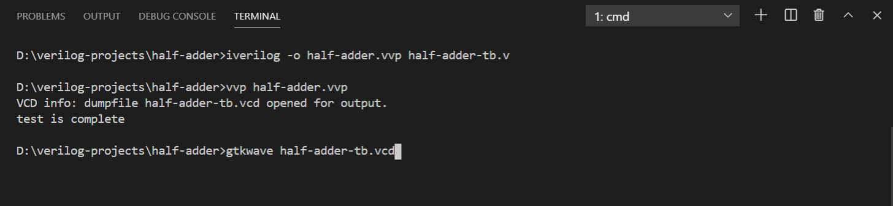
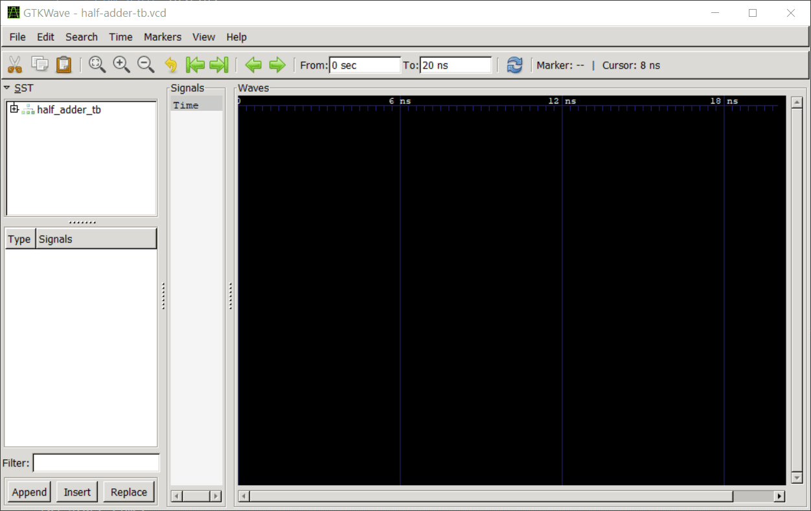

 ## **_`microprocessor, the heart of computer`_**

# verilog-workflow

We can use any text-editor and any extension for setting up our verilog workflow. I am using Visual Studio Code with a verilog extension. 
We can use Model Simulator also. 

# example 

## file structure 

```bash
├── half-adder
   ├── half-adder.v
   └── half-adder-tb.v
```
> `half-adder.v` is main code 

```verilog
module halfadder(a,b,sum,carry);

    input a,b;
    output sum, carry;

    wire sum, carry;
    assign sum = a ^ b;      // sum bit  (a xor b)
    assign carry = (a & b) ; //carry bit

endmodule 
```

> `half-adder-tb.v` is testbench

```verilog
`timescale 1ns/1ns
`include "half-adder.v"

module half_adder_tb;
    reg a, b;
    wire sum, carry;

    halfadder uut(a,b,sum,carry);
  
    initial // initial block executes only once
    begin
        $dumpfile("half-adder-tb.vcd"); 
        $dumpvars(0, half_adder_tb); //dumps ALL the variables of tOP module and all the variables in ALL lower level modules instantiated by this top module
       
        a = 0; b = 0; #5;
        a = 0; b = 1; #5;
        a = 1; b = 0; #5;
        a = 1; b = 1; #5;
        
        $display("test is complete");
    end

endmodule

```

## terminal



## timing-diagram



# reference

- icarus   http://bleyer.org/icarus/
- vscode   https://code.visualstudio.com/download
- circuitverse https://circuitverse.org/
- modelsim https://www.mentor.com/company/higher_ed/modelsim-student-edition

