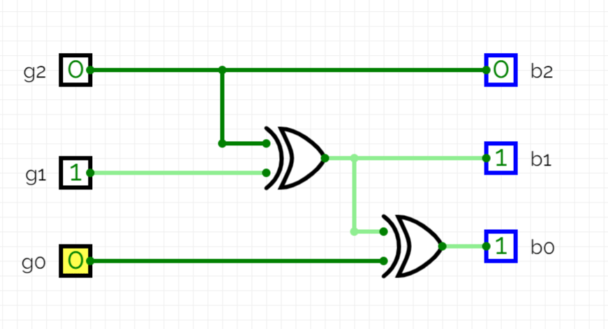

[link to circuit](https://circuitverse.org/simulator/embed/gray2binary)



# gray2binary.v

```verilog
module gray2bin #(
      parameter N = 4
   ) (
      input  [N-1:0] gray_in,
      output wire [N-1:0] binary_out
   );
   wire [N-1:0] temp;
   assign binary_out = temp;

   assign temp[N-1] = gray_in[N-1];
   
   genvar i;
   generate 
   for (i=N-2; i>=0; i=i-1)
   begin
   assign temp[i] = temp[i+1]^ gray_in[i];
   end
   endgenerate

endmodule
```