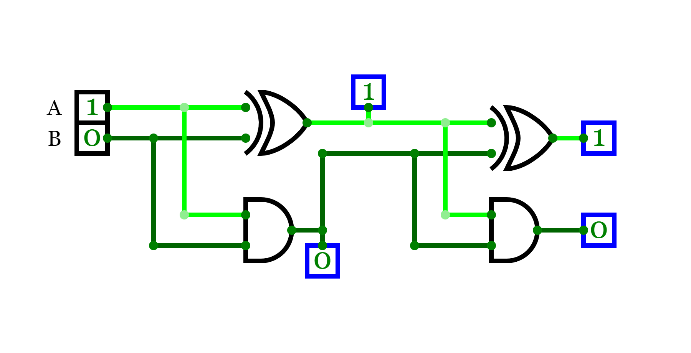

[link to circuit](https://circuitverse.org/simulator/embed/half-adder-instantiation)



# half-adder-instantiation.v
```verilog
module halfadder(a,b,sum,carry);

    input a,b;
    output sum, carry;

    wire sum, carry;
    assign sum = a ^ b;      // sum bit  (a xor b)
    assign carry = (a & b) ; //carry bit

endmodule 

module halfadder_inst(m,n,sum_out,carry_out);

    input m,n;
    output sum_out,carry_out;

    wire sum_out1,carry_out1;

    halfadder halfadder1(.a(m),.b(n),.sum(sum_out1),.carry(carry_out1));
    halfadder halfadder2(.a(sum_out1),.b(carry_out1),.sum(sum_out),.carry(carry_out));

endmodule 
```
# half-adder-instantiation-tb.v

```verilog
`timescale 1ns/1ns
`include "half-adder-instantiation.v"

module half_adder_instantiation_tb;
    reg m, n;
    wire sum_out,carry_out;

    halfadder_inst uut(m,n,sum_out,carry_out);
  
    initial // initial block executes only once
    begin
        $dumpfile("half-adder-instantiation-tb.vcd"); 
        $dumpvars(0, half_adder_instantiation_tb); //dumps ALL the variables of TOP module and all the variables in ALL lower level modules instantiated by this top module
       
        m = 0; n = 0; #5;
        m = 0; n = 1; #5;
        m = 1; n = 0; #5;
        m = 1; n = 1; #5;
        
        $display("test is complete");
    end

endmodule

```
# terminal 

 - `iverilog -o half-adder-instantiation-tb.vvp half-adder-instantiation-tb.v`

 - `vvp half-adder-instantiation-tb.vvp`

 - `gtkwave half-adder-instantiation-tb.vcd`


