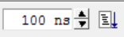
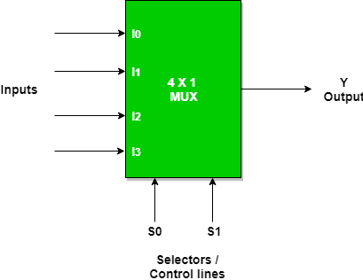
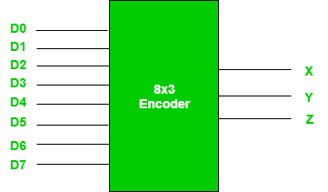

# North Star :star:

# To Do

- [x]  basic gates
- [ ]  4-bit ripple counter
- [ ]  T-flip flop

# Resources

   <a href="https://hdlbits.01xz.net/wiki/Main_Page"></a>

   [https://www.doulos.com/knowhow/verilog/](https://www.doulos.com/knowhow/verilog/)

   [https://ocw.mit.edu/courses/electrical-engineering-and-computer-science/6-884-complex-digital-systems-spring-2005/lecture-notes/](https://ocw.mit.edu/courses/electrical-engineering-and-computer-science/6-884-complex-digital-systems-spring-2005/lecture-notes/)

   [https://people.ece.cornell.edu/land/courses/ece5760/Verilog/Verilog_index.html](https://people.ece.cornell.edu/land/courses/ece5760/Verilog/Verilog_index.html)

   https://www.quora.com/What-are-the-sources-for-the-Verilog-HDL-Code-Learn

   http://asic.co.in/Index_files/verilogexamples.htm

   http://www.testbench.in/

   https://www.whoishostingthis.com/resources/verilog/#online-resources

   http://www.asic-world.com/verilog/veritut.html

   https://www.geeksforgeeks.org/multiplexer-design-using-verilog-hdl/

   https://www.geeksforgeeks.org/digital-electronics-logic-design-tutorials/

   https://github.com/ashishrana160796/verilog-starter-tutorials

   https://github.com/sayden/verilog-tutorials

# ModelSim

compile 

simulate>work>filename_tb.v → sim>add wave

wave>run 



without testbench → wave>right click on signal to add clock 

# GTKwave

    ```bash
    iverilog -o d-flipflop-tb.vvp d-flipflop-tb.v
    vvp d-flipflop-tb.vvp
    gtkwave d-flipflop.vcd
    ```

# always @ ()

 ```verilog
    reg out;
    always @(a or b or sel)
    if (sel)
    out = a;
    else
    out = b;
    ```
**The  `always` keyword forms a never-ending loop. When the `@()` operator is added, one iteration of the loop happens whenever the named values change.**

# Basics 

- non-blocking assignment (`<=`)

- blocking assignment (`=`)

- naming conventions

    all in small except `CONSTANTS`

## assign

    continuous statement 

    LHS must be `net` data type

    RHS can be function call or register

    ***LHS can't be 'reg'***

## **Levels of abstraction**
    - Behavioral Level( Design of Algorithm ) : Algorithmic and performance oriented programs are written with it.
    - Dataflow Level( Design of Equation ) : "assign" keyword is used for dataflow modelling. ex : assign c = a+b;
    - Gate Level( Interconnection with Logic Gates ) : Circuits will be defined by logic gates. ex : and(output, input) etc.
    - Switch Level( Implementation in terms of switches ) : Transistors either MOS or switches which conduct or are open. This style is complex and decreasing in popularity.
- **Data Types**

    Two primary data-types are as follows :

    - Nets : Connection between the components. Internal connection & is needed to be hidden from the user. Like, wire a;
    - Registers : Store the data in variable. Like, reg a;

    Other data-types are :

    - Vectors : nets and registers can be declared as vectors with different widths. Like, wire[2:0] a; reg[7:0] b;
    - Values : 0(Logical zero/false), 1(Logical one/true), X(Unknown Logic Value), Z(High Impedance).

    Integers, Arrays, Memories, Parameters, Strings are few other data types.

# instantiation

    Module Instantiation : Process of connecting one module to another. Its subparts are Positional Mapping and Nomenclature Based Mapping.

    ```verilog
    module pos_map(q,clk,rst)
           output[1:0] q;
           input clk, rst;
           tflipflop lab0(q[0], clk, rst);
           tflipflop lab1(q[1], clk, rst);
     end
    ```

    ```verilog
     module nom_map(q,clk,rst)
           output[1:0] q;
           input clk, rst;
           tflipflop lab0(.q(q[0]), .clk(clk), .rst(rst));
           tflipflop lab1(.q(q[0]), .clk(clk), .rst(rst));
      end
    ```

`$display` vs `$monitor`: $dispay is used to display immediate value of variables. It gets executed in an active region. $monitor gets executed whenever the value of the given variable changes in it. It gets executed in the postponed region. Monitor is required only once to be written.

# mux

    ```verilog
    always @ (sel or din_0 or din_1)
    	begin : MUX
    	   if (sel == 1'b0) 
    				begin     
    					mux_out = din_0;
    				 end 
    			else 
    				begin       
    					mux_out = din_1 ;
    			  end
    	end
    ```

    

# encoder and decoders

    

    An encoder is a combinational circuit that converts binary information in the form of a $2^N$ input lines into N output lines, which represent N bit code for the input. For simple encoders, it is assumed that only one input line is active at a time.

    A `priority encoder` is an encoder circuit in which inputs are given priorities. When more than one inputs are active at the same time, the input with higher priority takes precedence and the output corresponding to that is generated.